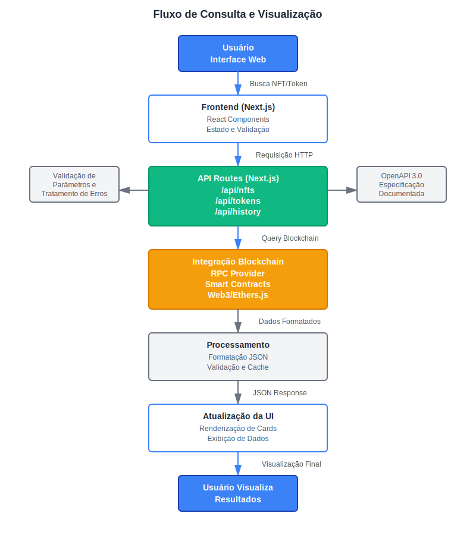
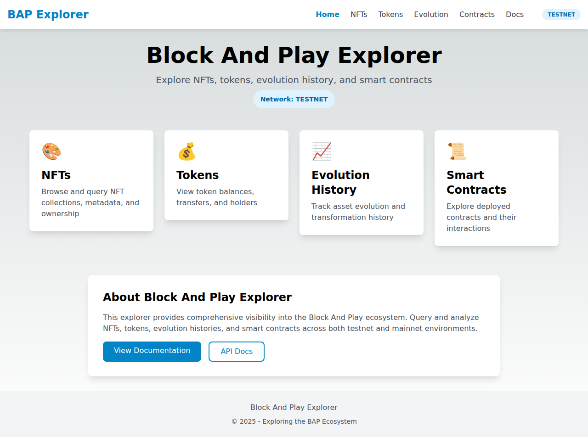
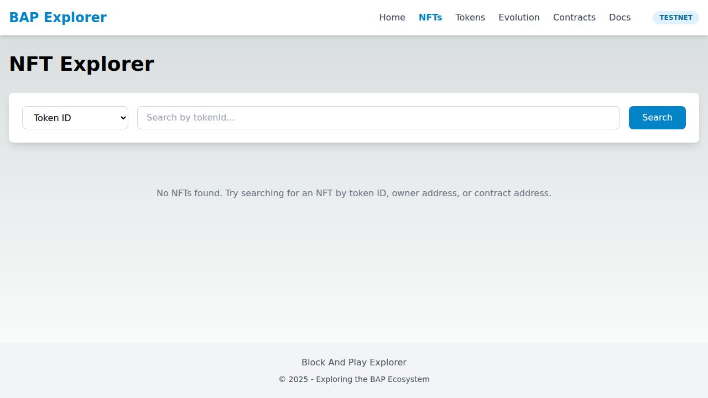

# Documentação de Arquitetura - BAP Explorer

## Visão Geral

O BAP Explorer é um explorador blockchain completo desenvolvido para o ecossistema Block And Play. A aplicação fornece visibilidade abrangente sobre NFTs, tokens, histórico de evolução e contratos inteligentes em ambientes testnet e mainnet.


## Arquitetura do Sistema

### Estrutura em Camadas

O sistema segue uma arquitetura em três camadas principais:

1. **Camada de Apresentação (Frontend)**
2. **Camada de API (Backend)**
3. **Camada de Blockchain**

### Diagrama de Fluxo de Consulta e Visualização



## Camada de Apresentação (Frontend)

### Tecnologias Utilizadas

#### Next.js 14
- **Server-Side Rendering (SSR)**: Melhora SEO e tempo de carregamento inicial
- **Static Site Generation (SSG)**: Páginas estáticas para melhor performance
- **Roteamento baseado em arquivos**: Estrutura intuitiva e escalável
- **API Routes**: Backend integrado para endpoints serverless
- **TypeScript**: Tipagem estática para maior segurança e manutenibilidade

#### React 18
- **Hooks**: useState, useEffect para gerenciamento de estado
- **Componentização**: Componentes reutilizáveis e modulares
- **Renderização condicional**: UX dinâmica baseada no estado
- **Eventos**: Manipulação de interações do usuário

#### Tailwind CSS
- **Utility-First**: Classes utilitárias para desenvolvimento rápido
- **Design Responsivo**: Mobile-first, adaptável a todos os dispositivos
- **Tema Customizado**: Cores primárias personalizadas para a marca BAP
- **Dark Mode**: Suporte nativo a tema escuro
- **Configuração**: `tailwind.config.js` com paleta de cores customizada

### Estrutura de Componentes

#### Layout Principal (`components/Layout.tsx`)
```
Layout
├── Header
│   ├── Logo
│   ├── Navigation Menu
│   │   ├── Home
│   │   ├── NFTs
│   │   ├── Tokens
│   │   ├── Evolution
│   │   ├── Contracts
│   │   └── Docs
│   └── Network Indicator (Testnet/Mainnet)
└── Footer
    ├── Copyright
    └── Links
```

O componente Layout envolve todas as páginas, garantindo:
- Navegação consistente
- Indicador de rede visível
- Estilo uniforme
- Rodapé informativo

### Páginas Principais

#### 1. Página Inicial (`pages/index.tsx`)



**Funcionalidades:**
- Apresentação do explorer
- Cards de navegação para cada seção
- Indicador de rede ativa
- Links para documentação e API

**Elementos visuais:**
- 4 cards principais: NFTs, Tokens, Evolution History, Smart Contracts
- Seção "About" com descrição do projeto
- Botões de call-to-action para documentação

#### 2. NFT Explorer (`pages/nfts.tsx`)



**Funcionalidades:**
- Busca por Token ID, Owner ou Contract Address
- Exibição em grid responsivo
- Cards de NFT com metadata
- Loading states e mensagens de erro

**Interface:**
- Dropdown para tipo de busca
- Campo de input para query
- Botão de busca com estado de loading
- Grid de resultados (1 coluna mobile, 2 tablet, 3 desktop)

**Estrutura de dados NFT:**
```typescript
interface NFT {
  id: string
  name: string
  owner: string
  tokenId: string
  contract: string
  metadata: {
    image?: string
    description?: string
  }
}
```

#### 3. Token Explorer (`pages/tokens.tsx`)

**Funcionalidades:**
- Busca por endereço de contrato
- Informações do token (nome, símbolo, supply)
- Lista de transferências recentes
- Dados de holders

**Visualização:**
- Card com informações do token
- Tabela de transferências
- Paginação de resultados

#### 4. Histórico de Evolução (`pages/history.tsx`)

**Funcionalidades:**
- Busca por Asset ID
- Timeline de eventos
- Indicadores coloridos por tipo de evento
- Detalhes de transações

**Tipos de eventos:**
- Minted (criação)
- Transferred (transferência)
- Evolved (evolução)
- Burned (queima)

#### 5. Smart Contracts (`pages/contracts.tsx`)

**Funcionalidades:**
- Busca por endereço de contrato
- Informações do contrato
- Lista de métodos disponíveis
- Separação entre métodos read/write

### Estados da Aplicação

#### Loading States
```typescript
const [loading, setLoading] = useState(false)
```
- Botões desabilitados durante carregamento
- Mensagens de "Carregando..."
- Spinners ou indicators visuais

#### Error Handling
- Try-catch em todas as chamadas de API
- Mensagens de erro amigáveis
- Fallback para dados mock em desenvolvimento

#### Empty States
- Mensagens quando não há resultados
- Instruções de como buscar
- Sugestões de queries válidas

## Camada de API (Backend)

### Next.js API Routes

Todas as APIs seguem padrões RESTful e estão localizadas em `pages/api/`:

#### Estrutura de Endpoints

```
pages/api/
├── nfts.ts          # Consulta NFTs
├── tokens.ts        # Consulta Tokens
├── history.ts       # Histórico de evolução
└── contracts.ts     # Informações de contratos
```

### Endpoint: `/api/nfts`

**Parâmetros:**
- `type`: 'tokenId' | 'owner' | 'contract'
- `query`: string (ID, endereço ou contrato)

**Resposta:**
```json
{
  "nfts": [
    {
      "id": "1",
      "name": "BAP NFT #1",
      "owner": "0x1234...5678",
      "tokenId": "1",
      "contract": "0x0000...0000",
      "metadata": {
        "image": "ipfs://...",
        "description": "..."
      }
    }
  ],
  "total": 1
}
```

### Endpoint: `/api/tokens`

**Parâmetros:**
- `address`: string (endereço do contrato)

**Resposta:**
```json
{
  "token": {
    "id": "1",
    "symbol": "BAP",
    "name": "Block And Play Token",
    "address": "0x...",
    "totalSupply": "1000000",
    "decimals": 18,
    "holders": 100
  },
  "transfers": [
    {
      "id": "tx1",
      "from": "0x...",
      "to": "0x...",
      "amount": "100",
      "timestamp": "2025-01-01T00:00:00Z",
      "txHash": "0x..."
    }
  ]
}
```

### Endpoint: `/api/history`

**Parâmetros:**
- `assetId`: string (ID do asset)

**Resposta:**
```json
{
  "events": [
    {
      "id": "evt1",
      "assetId": "1",
      "eventType": "minted",
      "from": "0x0000000000000000000000000000000000000000",
      "to": "0x...",
      "timestamp": "2025-01-01T00:00:00Z",
      "txHash": "0x...",
      "metadata": {}
    }
  ],
  "total": 10
}
```

### Endpoint: `/api/contracts`

**Parâmetros:**
- `address`: string (endereço do contrato)

**Resposta:**
```json
{
  "contract": {
    "id": "1",
    "address": "0x...",
    "name": "BAP NFT Contract",
    "type": "ERC721",
    "deployed": "2025-01-01T00:00:00Z",
    "methods": [
      {
        "name": "balanceOf",
        "type": "read",
        "inputs": ["address"],
        "outputs": ["uint256"]
      }
    ]
  }
}
```

### Especificação OpenAPI 3.0

A API completa está documentada usando OpenAPI 3.0, disponível em:
- Interface visual: `/docs/openapi`
- Arquivo JSON: Pode ser exportado da interface

**Benefícios:**
- Documentação sempre atualizada
- Fácil integração com ferramentas (Postman, Swagger)
- Validação automática de schemas
- Exemplos de request/response

### Tratamento de Erros

```typescript
try {
  // Lógica da API
} catch (error) {
  console.error('Erro:', error)
  res.status(500).json({ 
    error: 'Erro ao processar requisição',
    message: error.message 
  })
}
```

**Códigos de status HTTP:**
- `200`: Sucesso
- `400`: Bad Request (parâmetros inválidos)
- `404`: Not Found (recurso não encontrado)
- `500`: Internal Server Error
- `503`: Service Unavailable (RPC error)

### Validação de Entrada

```typescript
// Validação de endereço Ethereum
const isValidAddress = (address: string) => {
  return /^0x[a-fA-F0-9]{40}$/.test(address)
}

// Validação de parâmetros
if (!query || !type) {
  return res.status(400).json({ 
    error: 'Parâmetros obrigatórios ausentes' 
  })
}
```

## Camada de Blockchain

### Integração Web3

#### Provedor RPC

Configuração do provedor para comunicação com a blockchain:

```typescript
import { ethers } from 'ethers'

const provider = new ethers.JsonRpcProvider(
  process.env.NEXT_PUBLIC_RPC_URL
)
```

**Provedores suportados:**
- Infura
- Alchemy
- QuickNode
- RPC Node próprio

#### Contratos Inteligentes

**NFT Contract (ERC-721):**
```typescript
const nftContract = new ethers.Contract(
  process.env.NEXT_PUBLIC_NFT_CONTRACT,
  NFT_ABI,
  provider
)
```

**Token Contract (ERC-20):**
```typescript
const tokenContract = new ethers.Contract(
  process.env.NEXT_PUBLIC_TOKEN_CONTRACT,
  TOKEN_ABI,
  provider
)
```

### Consultas Blockchain

#### Consulta de NFT por Token ID

```typescript
const owner = await nftContract.ownerOf(tokenId)
const tokenURI = await nftContract.tokenURI(tokenId)
const metadataResponse = await fetch(tokenURI)
const metadata = await metadataResponse.json()
```

#### Consulta de NFTs por Owner

```typescript
const balance = await nftContract.balanceOf(ownerAddress)
const nfts = []

for (let i = 0; i < balance; i++) {
  const tokenId = await nftContract.tokenOfOwnerByIndex(ownerAddress, i)
  // Buscar metadata...
  nfts.push(nftData)
}
```

#### Consulta de Token

```typescript
const name = await tokenContract.name()
const symbol = await tokenContract.symbol()
const decimals = await tokenContract.decimals()
const totalSupply = await tokenContract.totalSupply()
```

#### Consulta de Eventos

```typescript
const filter = contract.filters.Transfer(null, null, tokenId)
const events = await contract.queryFilter(filter)

const formattedEvents = await Promise.all(
  events.map(async (event) => {
    const block = await event.getBlock()
    return {
      from: event.args.from,
      to: event.args.to,
      timestamp: new Date(block.timestamp * 1000).toISOString()
    }
  })
)
```

### Otimizações

#### Batch Requests

Usar `Promise.all` para múltiplas chamadas paralelas:

```typescript
const [name, symbol, decimals, totalSupply] = await Promise.all([
  contract.name(),
  contract.symbol(),
  contract.decimals(),
  contract.totalSupply()
])
```

#### Caching

Implementar cache para dados imutáveis:

```typescript
import { unstable_cache } from 'next/cache'

const getCachedMetadata = unstable_cache(
  async (tokenId) => {
    return await fetchMetadata(tokenId)
  },
  ['nft-metadata'],
  { revalidate: 3600 } // 1 hora
)
```

#### Fallback Providers

Múltiplos provedores para redundância:

```typescript
const providers = [
  new ethers.JsonRpcProvider(RPC_URL_1),
  new ethers.JsonRpcProvider(RPC_URL_2),
  new ethers.JsonRpcProvider(RPC_URL_3)
]

const provider = new ethers.FallbackProvider(providers)
```

## Configuração de Ambiente

### Variáveis de Ambiente

Arquivo `.env.local`:

```env
# Network Configuration
NEXT_PUBLIC_NETWORK=testnet

# RPC Endpoint
NEXT_PUBLIC_RPC_URL=https://rpc.blockandplay.testnet.example.com

# API Configuration
NEXT_PUBLIC_API_URL=http://localhost:3000/api

# Contract Addresses
NEXT_PUBLIC_NFT_CONTRACT=0x1234567890123456789012345678901234567890
NEXT_PUBLIC_TOKEN_CONTRACT=0x0987654321098765432109876543210987654321

# Chain Configuration
NEXT_PUBLIC_CHAIN_ID=80001
NEXT_PUBLIC_CHAIN_NAME=Block And Play Testnet
```

**Convenção:**
- `NEXT_PUBLIC_*`: Variáveis acessíveis no cliente
- Sem prefixo: Variáveis apenas no servidor

### Redes Suportadas

#### Testnet
- **Chain ID**: 80001
- **Uso**: Desenvolvimento e testes
- **Características**: Tokens de teste gratuitos

#### Mainnet
- **Chain ID**: A definir
- **Uso**: Produção
- **Características**: Tokens reais, custos de gas

## Fluxo de Dados Completo

### Exemplo: Busca de NFT

1. **Usuário** entra com Token ID e clica em "Search"
2. **Frontend** valida input e chama `/api/nfts?type=tokenId&query=1`
3. **API Route** recebe requisição e valida parâmetros
4. **API** chama contrato via Web3: `contract.ownerOf(1)`
5. **Blockchain** retorna dados do NFT
6. **API** busca metadata do tokenURI
7. **API** formata resposta JSON
8. **Frontend** recebe dados e atualiza estado
9. **React** re-renderiza com os NFT cards
10. **Usuário** visualiza resultados

### Tratamento de Erros no Fluxo

```
Erro no Input → Validação Frontend → Mensagem ao usuário
     ↓
Erro na API → Try/Catch → Retorna erro 400/500
     ↓
Erro RPC → Fallback Provider → Retry ou erro 503
     ↓
Erro de Rede → Catch Frontend → Mensagem de erro amigável
```

## Segurança

### Frontend
- Validação de inputs antes de enviar
- Sanitização de dados exibidos
- Proteção contra XSS
- CSP (Content Security Policy)

### API
- Validação de parâmetros
- Rate limiting (recomendado em produção)
- CORS configurado
- Autenticação para operações de escrita (se necessário)

### Blockchain
- Validação de endereços Ethereum
- Tratamento de erros de RPC
- Retry logic para falhas temporárias
- Monitoramento de uso e custos

## Performance

### Métricas de Performance

- **First Contentful Paint (FCP)**: < 1.5s
- **Largest Contentful Paint (LCP)**: < 2.5s
- **Time to Interactive (TTI)**: < 3.5s
- **Cumulative Layout Shift (CLS)**: < 0.1

### Otimizações Implementadas

#### Next.js
- Automatic code splitting
- Image optimization
- Font optimization
- Script optimization

#### React
- Component memoization
- Lazy loading
- Conditional rendering
- Event debouncing

#### CSS
- Tailwind CSS purge
- Critical CSS inline
- CSS minification

## Deploy e CI/CD

### Plataformas Recomendadas

#### Vercel (Recomendado)
```yaml
Framework Preset: Next.js
Build Command: npm run build
Output Directory: .next
Install Command: npm install
```

**Vantagens:**
- Deploy automático do GitHub
- Preview deployments para PRs
- Edge Functions globais
- CDN integrado
- Zero configuração

#### Netlify
Similar ao Vercel, com configuração automática para Next.js

### Pipeline CI/CD

```
Git Push → GitHub
    ↓
Webhook → Plataforma de Deploy
    ↓
Build Process
    ├── npm install
    ├── npm run lint
    ├── npm run build
    └── Otimização
    ↓
Deploy Production
    ├── Static Assets → CDN
    ├── API Routes → Serverless
    └── Edge Functions
    ↓
Live ✓
```

### Configuração de Build

**next.config.js:**
```javascript
/** @type {import('next').NextConfig} */
const nextConfig = {
  reactStrictMode: true,
  images: {
    domains: ['ipfs.io', 'gateway.pinata.cloud'],
  },
}

module.exports = nextConfig
```

## Monitoramento e Observabilidade

### Métricas Recomendadas

#### Application Performance
- Tempo de resposta das APIs
- Taxa de erro (4xx, 5xx)
- Uso de memória
- Tempo de build

#### Blockchain
- Chamadas RPC por minuto
- Taxa de erro de RPC
- Tempo de resposta do provider
- Custos de API

#### User Experience
- Page views
- Bounce rate
- Tempo na página
- Conversão (buscas bem-sucedidas)

### Ferramentas Sugeridas

- **Vercel Analytics**: Built-in performance monitoring
- **Sentry**: Error tracking
- **Google Analytics**: User behavior
- **Prometheus + Grafana**: Métricas customizadas

## Escalabilidade

### Arquitetura Serverless

**Vantagens:**
- Escala automática sob demanda
- Sem gerenciamento de servidor
- Paga apenas pelo uso
- Alta disponibilidade

**Considerações:**
- Cold starts (primeiras requisições)
- Limites de timeout (10s - 30s típico)
- Limites de memória

### Estratégias de Cache

#### Cache de Aplicação
```typescript
// Cache em memória (curto prazo)
const cache = new Map()

function getCached(key, fetchFn, ttl = 60000) {
  if (cache.has(key)) {
    const { value, expiry } = cache.get(key)
    if (Date.now() < expiry) return value
  }
  
  const value = fetchFn()
  cache.set(key, { value, expiry: Date.now() + ttl })
  return value
}
```

#### Cache de Blockchain
- Dados históricos (imutáveis): Cache longo (dias)
- Dados de estado (mutáveis): Cache curto (minutos)
- Metadata de NFT: Cache médio (horas)

### Database Layer (Futuro)

Para escala maior, considerar:
- **PostgreSQL**: Dados relacionais
- **MongoDB**: Dados de documento
- **Redis**: Cache distribuído
- **The Graph**: Indexação blockchain

## Testes

### Estratégia de Testes

#### Testes Unitários
```typescript
// Exemplo: Validação de endereço
describe('isValidAddress', () => {
  it('deve validar endereço válido', () => {
    expect(isValidAddress('0x1234567890123456789012345678901234567890'))
      .toBe(true)
  })
  
  it('deve rejeitar endereço inválido', () => {
    expect(isValidAddress('0xinvalid')).toBe(false)
  })
})
```

#### Testes de Integração
- Testar API routes com mock de blockchain
- Testar fluxo completo de busca
- Testar error handling

#### Testes E2E
```typescript
// Exemplo com Playwright/Cypress
test('buscar NFT por token ID', async ({ page }) => {
  await page.goto('http://localhost:3000/nfts')
  await page.fill('input[type="text"]', '1')
  await page.click('button:has-text("Search")')
  await expect(page.locator('.nft-card')).toBeVisible()
})
```

### Testes em Desenvolvimento

```bash
# Executar testes
npm run test

# Executar com coverage
npm run test:coverage

# Executar E2E
npm run test:e2e
```

## Manutenção e Evolução

### Atualizações Recomendadas

#### Dependências
```bash
# Verificar atualizações
npm outdated

# Atualizar dependências
npm update

# Atualizar Next.js
npm install next@latest react@latest react-dom@latest
```

#### Auditoria de Segurança
```bash
# Verificar vulnerabilidades
npm audit

# Corrigir automaticamente
npm audit fix
```

### Roadmap Futuro

#### Curto Prazo (1-3 meses)
- [ ] Implementar cache Redis
- [ ] Adicionar mais filtros de busca
- [ ] Melhorar performance de loading
- [ ] Adicionar analytics

#### Médio Prazo (3-6 meses)
- [ ] Integração com The Graph
- [ ] Suporte a múltiplas chains
- [ ] Wallet connection
- [ ] Transações write

#### Longo Prazo (6-12 meses)
- [ ] Mobile app (React Native)
- [ ] GraphQL API
- [ ] Real-time updates (WebSocket)
- [ ] Advanced analytics dashboard

## Referências

### Documentação Oficial
- [Next.js Documentation](https://nextjs.org/docs)
- [React Documentation](https://react.dev)
- [Tailwind CSS Documentation](https://tailwindcss.com/docs)
- [ethers.js Documentation](https://docs.ethers.org)

### Documentação do Projeto
- [README Principal](../README.md)
- [Guia de Integração de Contratos](./CONTRACT_INTEGRATION.md)
- [Documentação da API OpenAPI](http://localhost:3000/docs/openapi)

### Recursos Adicionais
- [ERC-721 Standard](https://eips.ethereum.org/EIPS/eip-721)
- [ERC-20 Standard](https://eips.ethereum.org/EIPS/eip-20)
- [OpenAPI Specification](https://swagger.io/specification/)

## Suporte

Para questões, problemas ou sugestões:
- Abra uma issue no GitHub
- Consulte a documentação
- Entre em contato com a equipe de desenvolvimento

---

**Última atualização**: Dezembro 2025
**Versão do documento**: 1.0
**Mantenedores**: Equipe BAP Explorer
